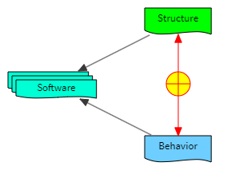

#### The problem with correctness:

`To the optimist, the glass is half-full.
To the pessimist, the glass is half-empty.
To the engineer, the glass is twice as big as it needs to be.
To the economist, too much money has been spent on the glass.`

---

`Am I testing this code, or is this code testing me?`

---

`How do programmers become wealthy?`
`I don't know...`
`Inheritance.`

`Most programmers have to wait until they get arrays.`

---

`I had a problem, so I decided to use OOP. Now I have a ProblemFactory...`

---

Therapist: `Do you get enough rest?`

Programmer: `Of course. REST is a lifestyle.`

---

Also see [Programmer Humor](https://www.reddit.com/r/ProgrammerHumor/comments/xf4jyj/object_oriented_programming_ftw/?rdt=47469)
and https://www.reddit.com/r/ProgrammerHumor/.

---

`To understand recursion, you must first understand recursion.`

---

#### K.I.S.S. demonstrated:

```csharp
// Customer advice: keep it simple.
public class CustomerSuppliedPredicate : IPredicate
{
    public bool ItRainedYesterday { get; init; }
    public bool MySocksAreStillWet { get; init; } 
    public bool MaryWillCallMeTomorrow { get; init; }
    public bool ThereIsATrafficJamOnRoute66 { get; init; } 
    public bool IWillBeFamousInOneYear { get; init; }
    public bool ConditionalNestingOverflows { get; init; }
    public bool CyclomaticComplexityIsViolated { get; init; }
    
    public bool IsSatisfied()
    {
        if (IWillBeFamousInOneYear)
        {
            if (!ItRainedYesterday || !MySocksAreStillWet)
            {
                if (MaryWillCallMeTomorrow)
                {
                    if (!ThereIsATrafficJamOnRoute66)
                    {
                        if (ConditionalNestingOverflows || CyclomaticComplexityIsViolated)
                        {
                            return true;
                        }
                    }
                }
            }
        }
        
        return false;
    }
}

try
{
    var result = new CustomerSuppliedPredicate().IsSatisfied();
    
    if (result)
    {
        System.Random.Shared.Next(1, 4) switch
        {
            1 => DoSomethingArbitrary_1(),
            2 => DoSomethingArbitrary_2(),
            3 => DoSomethingArbitrary_3()
        }
    }
}
catch (TooManyConditionsException ex)
{
    // Don't even try to fix this.
    // The real problem actually is not in the code, even though the code is bad...
}

// Programmer reimplementation:
// - Follow customer advice.
// - Apply KISS.
// - Use advanced programming techniques.
// - Deliver expected functionality.
public class ImprovedPredicate : IPredicate, IHighlyAccurateEstimate
{
    public bool IsSatisfied()
        => System.Random.Shared.Next(0, 2) == 1;
}
```

---

```csharp
public interface IRule;
```

---

`My biggest challenge right now is to bring order and routine to what otherwise becomes a guessing game of chance: I need a method (pun intended).` ~ _Phundamentals_

---

`The right structure of a software system is more important than its correct behavior.` ~ _Stefano Santilli_

<!---->
<!---->

[The Zero Principle of Software Design](https://www.linkedin.com/pulse/zero-principle-software-design-stefano-santilli#:~:text=Here%20is%20the%20%E2%80%98Zero%20Principle%20of%20Software%20Design%E2%80%99)

---

`The creative mind cannot be made subject to the principles of production systems nor be imprisoned in its methodology
without impairing its creative potential, no matter how hard one craves control.
Creativity or control, choose one.` ~ Phundamentals

---

`What's the value of being wise, when being right is the only thing that matters?` ~ Phundamentals

---

`Nothing is more dangerous than an idea when it is the only one you have.` ~ _Emil Chartier Alain_

---

#### Definitions and Terms

IO
: ~~Input/Output~~ Information Overload

AIO
: ~~All In One~~ Assault by Information Overload

HIO
: ~~Health Information Organization~~ Hurt by Information Overload

BIO
: ~~Biography~~ Brain-damaged by Information Overload

---

`Many rules were created so we could keep up appearances and hide behind them, but we, truthseekers, cannot.` ~ _Phundamentals_

**AKA**: _Boolean logic_

`Rule systems were created by rulers to control the mind of those being ruled.
They are meant to distract from the control that is being exercised through them.` ~ _Phundamentals_

---

`There are no secrets to success. It is the result of preparation, hard work, and learning from failure.` ~ _Colin Powell_

`Decisions are often based on intuition. Intuition requires experience. Experiences requires making a lot of mistakes.`

---

`Encapsulate what varies, and separate it from what stays the same.` ~ _The Many_

---

`False hopes must be crushed.`

1. If it seems too difficult, then _arrive there faster_.
2. If it is too difficult, then _accept the fact_.

---

[The Psychology of Coding: Overcoming Mental Blocks and Staying Motivated](https://www.skillreactor.io/blog/the-psychology-of-coding-overcoming-mental-blocks-and-staying-motivated/)

---

[Second Order Thinking](https://fs.blog/chestertons-fence/)

`D.R.Y.M. Don't Repeat Your Mistakes...`

[DRY gone bad](https://aaronstannard.com/dry-gone-bad-bespoke-company-framework/)

---

`If you want to go fast, go alone. If you want to go far, go together.` ~ _African proverb_
